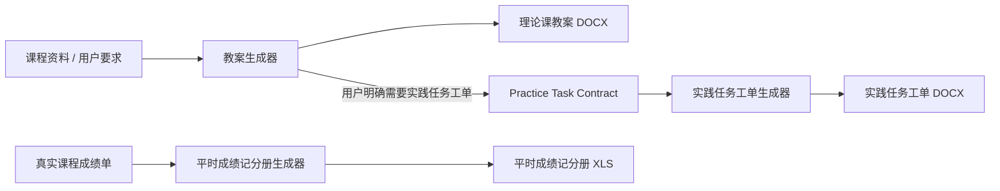

<div align="center">

# Codex Work Skills

**面向真实教学工作的可复用 AI Skills**

教案 · 实践任务工单 · 平时成绩记分册


</div>

---

## 这是什么

`codex-work-skills` 是一组面向中文教学工作的 AI Skills。

目标不是让模型自由输出一份“看起来像文件”的文本，而是让 Agent 先理解课程资料和用户要求，再通过稳定的内容合同与真实模板生成可继续使用的教学文件。

当前首页只展示已经合并并可用的 Skill；仍在开发或尚未收口的功能不在这里承诺。

## 可用 Skills

| Skill | 当前版本 | 主要用途 | 输出 |
| --- | --- | --- | --- |
| [📝 教案生成器](教案生成器/lesson-plan-docx-generator) | **2.2.3** | 课程规划、真实参考资料检索、项目化理论教案生成 | `.docx` |
| [📋 实践任务工单生成器](实践任务工单生成器/practice-task-workorder-generator) | **2.2.0 / Phase 2.2** | 根据实践教学单元生成学生任务工单 | `.docx` |
| [📊 平时成绩记分册生成器](平时成绩记分册生成器/course-gradebook-generator) | **当前稳定版** | 根据真实课程成绩单生成平时成绩记分册 | `.xls` |

> Skill 版本、内容合同版本和 Word / Excel 模板版本彼此独立。升级 Skill 不代表必须同步修改模板。

## 典型工作流



### 理论课与实践课的产物边界

以 `40 学时 = 20 理论 + 20 实践` 为例：

- 不生成实践任务工单：**10 份理论教案 + 0 份工单**；
- 生成实践任务工单：**10 份理论教案 + 10 份实践任务工单**；
- 每份教案默认对应 **2 个理论学时**；
- 每份任务工单固定对应 **2 个实践学时**。

实践课时本身不生成 Lesson DOCX；只有用户明确要求工单时，才进入实践任务工单流程。

---

## 📝 教案生成器 2.2.3

教案生成器面向高职、高校等中文教学场景，使用真实 Word 模板生成课程教学单元设计。

当前重点能力：

- 正式规划前一次性确认课程名称、专业、授课对象、总课时、理论/实践课时、组织方式和工单偏好；
- 未确认的理论/实践比例、组织方式和工单偏好保持“待确认”，不自动猜 50/50；
- Lesson DOCX 只覆盖理论课时，默认 **2 学时 / 份**；
- 用户确认的课程元数据贯穿内容合同和最终 DOCX，避免专业、授课对象等字段漂移；
- 教材、教学资源、参考文献严格分离，课程教材和 PPT / 课件不作为参考文献；
- 在具备联网能力时优先检索可核验的出版社、高校公开课程、国家/行业标准和权威公开资料，并保留真实责任者信息；
- 参考文献允许跨课合理复用，不为了“去重”强行制造不真实来源；
- 删除机械的“聚焦：xxx”等主题尾缀，正文以自然教学语言体现课次主题；
- 支持不同专业方向，避免固定领域场景污染；
- 教学评价分数限定在 **85–96**，支持 `0.5` 步长；
- 使用受保护的 `lesson-plan v1.1.2` Word 模板生成 `.docx`。

内容合同：**Lesson Content Contract 2.2**；实践侧上游合同：**Practice Task Contract 1.1**。
默认模板：**lesson-plan v1.1.2**。

[查看教案生成器](教案生成器/lesson-plan-docx-generator) · [Lesson Acceptance](docs/lesson-acceptance.md)

---

## 📋 实践任务工单生成器 2.2.0

实践任务工单用于承接课程中的实践教学单元。

当前规则：

- **1 个实践教学单元 = 2 学时 = 1 份任务工单**；
- Lesson 只有在用户明确要求生成工单时才建立 Practice Task Contract；
- Practice Task 与 WorkOrder 一一对应；
- 关联工单使用 Practice Task Contract 1.1 和 WorkOrder Content 1.1 的完整来源任务快照；独立模式必须明确选择；
- 课堂考勤固定 **10 分**，其余任务评价合计 **90 分**，总分 100 分；
- 学生任务结果区保持空白，不生成教师答案；
- 使用真实 `practice-work-order v1.0.0` Word 模板；关联模式默认真实渲染通过后才交付。

[查看实践任务工单生成器](实践任务工单生成器/practice-task-workorder-generator)

---

## 📊 平时成绩记分册生成器

根据真实课程成绩单生成并校验平时成绩记分册。

- 输入必须包含真实成绩数据，Skill 不凭空编造成绩；
- 使用现有 Excel 模板完成写入和校验；
- 当前默认模板：`course-gradebook v1.1.0`。

[查看平时成绩记分册生成器](平时成绩记分册生成器/course-gradebook-generator)

---

## 快速安装

### 推荐：直接让 Agent 安装

适用于具备本地文件、Git 和终端访问能力的 Agent，例如 Codex、Claude Code、Gemini CLI、Cursor Agent、Cline 等。

复制下面这段即可：

```text
请帮我安装这个仓库中当前可用的教学 Skills：
https://github.com/ArdenZC/codex-work-skills

请先阅读 README.md 和根目录 AGENTS.md，再读取需要安装的 Skill 自己的 SKILL.md、AGENTS.md 和通用提示词.md。

优先使用各 Skill 自带的 scripts/install.py 完成安装；
不要修改 Skill 源码、模板或 manifest；
安装完成后检查依赖并确认 Skill 可以被当前 Agent 识别。
```

### Codex 手动安装

```bash
git clone https://github.com/ArdenZC/codex-work-skills.git
cd codex-work-skills
```

Windows PowerShell：

```powershell
python "教案生成器/lesson-plan-docx-generator/scripts/install.py"
python "实践任务工单生成器/practice-task-workorder-generator/scripts/install.py"
python "平时成绩记分册生成器/course-gradebook-generator/scripts/install.py"
```

macOS Terminal：

```bash
python3 "教案生成器/lesson-plan-docx-generator/scripts/install.py"
python3 "实践任务工单生成器/practice-task-workorder-generator/scripts/install.py"
python3 "平时成绩记分册生成器/course-gradebook-generator/scripts/install.py"
```

Codex 默认安装位置：

```text
~/.codex/skills/
├── lesson-plan-docx-generator/
├── practice-task-workorder-generator/
└── course-gradebook-generator/
```

常用安装参数：

- `--dry-run`：只查看安装计划；
- `--skills-dir <目录>`：指定 Skill 目录；
- `--replace`：替换已有安装；
- `--keep-backup`：替换成功后保留上一份安装备份（支持该参数的 installer）；
- `--doctor --json`：由源树只读比对已安装副本的 fingerprint，并要求 `status=current`。

---

## 怎么用

### 生成教案

```text
使用教案生成器生成《数据结构高级》课程教案。
总课时 40 学时，20 学时理论、20 学时实践，
理论与实践分开安排，每份教案 2 学时，
同时生成实践任务工单。
```

### 只生成理论教案

```text
生成《软件建模与设计》课程教案。
总课时 64 学时，32 学时理论、32 学时实践，
不生成实践任务工单。
```

### 生成实践任务工单

```text
根据已经确认的实践教学计划生成任务工单。
每份工单对应 2 个实践学时。
```

### 生成平时成绩记分册

```text
根据这份课程成绩单生成平时成绩记分册，并保持现有模板格式。
```

---

## 平台与运行方式

- 持续使用平台：**Windows、macOS**；
- Python 负责确定性校验、模板写入和文件生成；
- AI / Agent 负责理解课程资料、规划和创作教学内容；
- 各 Skill 提供面向 Codex 及其他 Agent 的 adapter；
- 完整 Skill 安装来源以仓库 `master` 为准；
- GitHub Release 中的 ZIP 主要用于版本化模板包，不等同于完整 Skill 安装包。

## 文档

- [CHANGELOG](CHANGELOG.md) — 用户可见版本变化
- [根目录 AGENTS.md](AGENTS.md) — 仓库级 Agent 规则
- [Lesson Acceptance](docs/lesson-acceptance.md) — 教案真实成品验收说明
- [教案生成器 SKILL.md](教案生成器/lesson-plan-docx-generator/SKILL.md)
- [实践任务工单生成器 SKILL.md](实践任务工单生成器/practice-task-workorder-generator/SKILL.md)
- [平时成绩记分册生成器 SKILL.md](平时成绩记分册生成器/course-gradebook-generator/SKILL.md)

---

## 项目原则

这个仓库优先解决真实工作结果，而不是追求测试数量或工程复杂度。

- 用户确认的信息必须进入最终成品；
- 能查证的资料应真实查证，不用教材、PPT 或占位内容凑参考文献；
- AI 负责内容创作，Python 不替模型拼接教学正文；
- 模板与用户文件优先保护；
- 自动化 QA 是为了提高成品可靠性，不应取代人工对真实输出的判断。

---

维护者：[@ArdenZC](https://github.com/ArdenZC)
